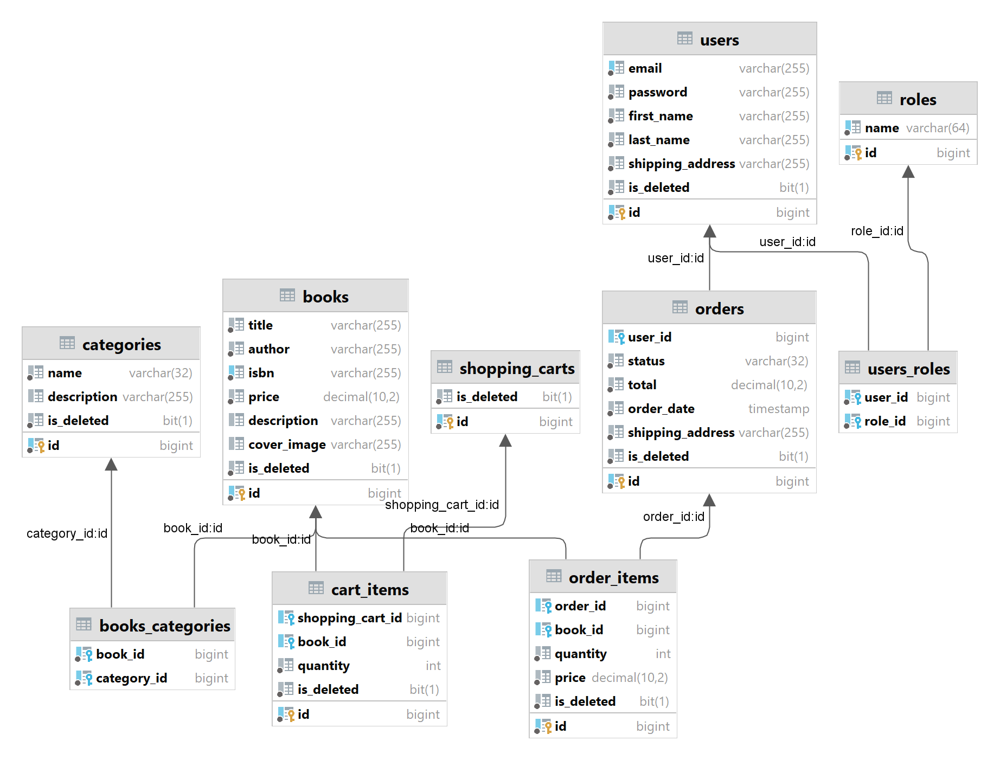

# Book Management – Spring Boot REST Application

## Table of Contents
- [Project Overview](#project-overview)
- [Technologies Used](#technologies-used)
- [Data Models & Relationships](#data-models--relationships)
- [Project Structure](#project-structure)
- [Getting Started](#getting-started)
- [Swagger Documentation](#swagger-documentation)
- [Postman Collection](#postman-collection)
- [Contact](#contact)

---

## Project Overview

**Book Management** is a stateless RESTful application with JWT-based authentication and user registration.  
It provides a platform for both **administrators** and **customers** to manage books, categories, orders, and shopping carts.

### Why This Project Was Created

This project was built to simulate the core functionality of a real-world e-commerce system and is suitable for use as:
- A production-ready backend template for small to medium online stores
- A reference architecture for building secure Java-based REST APIs using Spring Boot

Key business and technical motivations include:
- **End-to-End Functionality**: From user registration and authentication to order processing and cart management, the app mimics a complete e-commerce flow.
- **Scalability in Mind**: The data model and service design allow for easy expansion.
- **Security First**: Built with modern authentication techniques including JWT access and refresh tokens, role-based authorization, and secure token handling.
- **Modern Development Stack**: Integrates tools widely used in professional environments — like Docker, Liquibase, Swagger (OpenAPI), and MapStruct.

The application is built following **SOLID principles** and adopts a **Three-Tier Architecture**:
1. **Presentation Layer** – Controllers for handling client requests
2. **Business Logic Layer** – Services implementing application logic
3. **Data Access Layer** – Repositories for communication with the database

---

## Technologies Used

- **Java** `17`
- **Spring Boot** `3.4.2`
    - Spring Web
    - Spring Security
    - Spring Data JPA
- **Hibernate** `6.5.3.Final`
- **MySQL** `8.0.33`
- **MapStruct**
- **Liquibase**
- **Swagger**
- **Docker**
- **JSON Web Token**

---

## Data Models & Relationships



---

## Project Structure

```
src/
├── config/           → Application configuration
├── controller/       → REST API endpoints
├── dto/              → Data Transfer Objects
├── exception/        → Custom exceptions
├── mapper/           → MapStruct mappers for model ↔ DTO
├── model/            → Entity classes
├── repository/       → JPA repositories
├── security/         → JWT-based authentication & authorization
├── service/          → Business logic
└── validation/       → Custom validation annotations
```

### Key Controllers

#### `AuthenticationController`
| Method | Endpoint | Description | Access |
|--------|----------|-------------|--------|
| POST | `/api/auth/registration` | Register a new user | Public |
| POST | `/api/auth/login` | Authenticate and get JWT | Public |

#### `BookController`
| Method | Endpoint | Description | Access |
|--------|----------|-------------|--------|
| POST | `/api/books` | Add a new book | Admin |
| PUT | `/api/books/{id}` | Update book details | Admin |
| GET | `/api/books` | Get all books | Admin/User |
| GET | `/api/books/{id}` | Get book by ID | Admin/User |
| DELETE | `/api/books/{id}` | Delete book | Admin |
| GET | `/api/books/search` | Search books | Admin/User |

#### `CategoryController`
| Method | Endpoint                     | Description | Access |
|--------|------------------------------|-------------|--------|
| POST | `/api/categories`            | Add new category | Admin |
| PUT | `/api/categories/{id}`        | Update category | Admin |
| GET | `/api/categories`            | Get all categories | Admin/User |
| GET | `/api/categories/{id}`       | Get category by ID | Admin/User |
| DELETE | `/api/categories/{id}`       | Delete category | Admin |
| GET | `/api/categories/{id}/books` | Books by category | Admin/User |

#### `OrderController`
| Method | Endpoint | Description | Access |
|--------|----------|-------------|--------|
| POST | `/api/orders` | Create new order | User |
| GET | `/api/orders` | Get user's order history | User |
| PATCH | `/api/orders/{id}` | Update order status | Admin |
| GET | `/api/orders/{orderId}` | Get order items | User |

#### `ShoppingCartController`
| Method | Endpoint                    | Description | Access |
|--------|-----------------------------|-------------|--------|
| GET | `/api/cart`                 | Get shopping cart | User |
| POST | `/api/cart`                 | Add book in cart | User |
| PUT | `/api/cart/cart-items/{id}` | Update book quantity | User |
| DELETE | `/api/cart/cart-items/{id}` | Remove book from cart | User |

---

## Getting Started

### Prerequisites

Ensure you have the following installed:
- Java 17+
- Maven
- Docker & Docker Compose

### Steps

1. **Clone the repository:**
```bash
git clone https://github.com/Oleksii21th/book-management-system.git
cd book-management
```

2. **Create a `.env` file** in the project root using `.env-sample` as a reference.

3. **Build the project:**
```bash
mvn clean package
```

4. **Start the app using Docker Compose:**
```bash
docker-compose build
docker-compose up
```

5. Open your browser and go to:  
   `http://localhost:8088`

---

## Swagger Documentation

After launching the application, visit the Swagger UI for API reference:  
[http://localhost:8088/api/swagger-ui/index.html#/](http://localhost:8088/api/swagger-ui/index.html#/)

---

## Postman Collection
https://www.postman.com/oleksii-7208203/my-workspace/overview
A Postman collection is available to streamline API testing.

> To test as a regular user:
> - Register with any email/password.
> - Use `/api/auth/login` to get a JWT token.

> To test as an admin, use:
> ```
> Email: admin@gmail.com
> Password: password
> ```

---

## Challenges & Solutions

Throughout the development of this project, several real-world technical challenges arose. Here are a few notable ones and how they were addressed:

### Implementing Secure JWT Token Refresh Logic
**Challenge**: Handling expired access tokens while maintaining stateless authentication.  
**Solution**: Introduced a refresh token mechanism with secure HTTP-only cookies and token blacklisting to balance statelessness with security.

### Designing a Scalable Database Schema
**Challenge**: Modeling flexible relationships between books and categories (e.g., one book can belong to multiple categories).  
**Solution**: Used a many-to-many relationship with a join table, ensuring efficient querying and scalability as the catalog grows.

### Docker Compose Service Dependencies
**Challenge**: Initial application startup failed due to timing issues between Spring Boot and MySQL containers.  
**Solution**: Configured a `depends_on` clause and added a custom health check or wait-for-it script to ensure the database is fully ready before Spring Boot attempts a connection.

---

## Contact

**Developer**: Oleksii Babych
**Email**:   obabych1@stu.vistula.edu.pl
**GitHub**: https://github.com/Oleksii21th/book-management-system